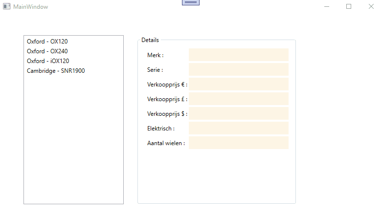

# Oefening Hoofdstuk 2  
  
Open de solution.  
Je krijgt een window te zien waar alle controls en event-handlers reeds op gemaakt zijn .    
  
## Deel 1  

Maak een Class Library aan met de naam Scala.Oefening02.Core.
Maak in deze Class Library een klasse aan met de naam Fiets.  
Zorg er voor dat zowel de klasse als alle memebers (eigenschappen, constructors, methode) buiten deze Class Library bruikbaar zijn. 

Een fiets heeft 5 eigenschappen :   
  * Merk : tekst  
  * Serie : tekst  
  * VerkoopprijsEuro : de prijs (in Euro, decimalen voorzien) waaraan deze fiets zal verkocht worden  
  * IsElektrisch : waar of niet waar  
  * AantalWielen : een geheel getal groter dan 0  

De klasse heeft 2 constructors : 
  * Een lege argumentloze constructor  
  * Een constructor die evenveel argumenten ontvangt als er eigenschappen zijn en deze argumenten vervolgens ook toekent aan de eigenschappen.  
  
De klasse overschrijft ook ook de ToString() methode.  Wat er precies moet afgebeeld worden in de plaats zie je in de demo onderaan.  
  
Tenslotte dien je nog een methode met de naam GetVerkoopprijsAndereMunt te voorzien in deze klasse die als argument een wisselkoers ontvangt in de vorm van een double.
De methode zelf retourneert een waarde van het type decimal.
De bedoeling is om de eigenschap VerkoopprijsEuro te herberekenen a.d.h.v. de meegeleverde wisselkoers.
Ter info :
  * 1 Euro = 0.88 Pond (£)  
  * 1 Euro = 1.2 Dollar ($)   
  

## Deel 2  

Bestudeer aandachtig de controls in je WPF venster.  

Tijdens het opstarten voeg je een aantal dummy fietsen toe aan de listbox (gebruik uiteraard instanties van je klasse hiervoor).  
Wanneer in de listbox een fiets wordt geselecteerd dan dienen alle eigenschappen van die fiets in de corresponderende controls te verschijnen.  
  

  

